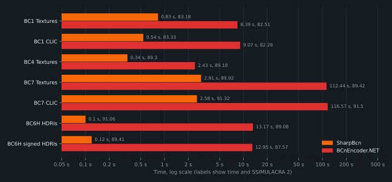
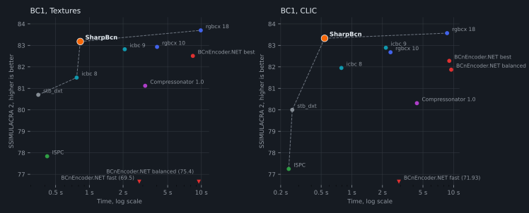
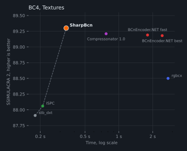
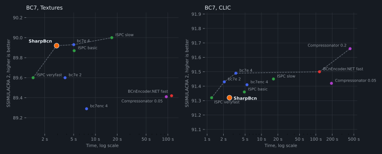
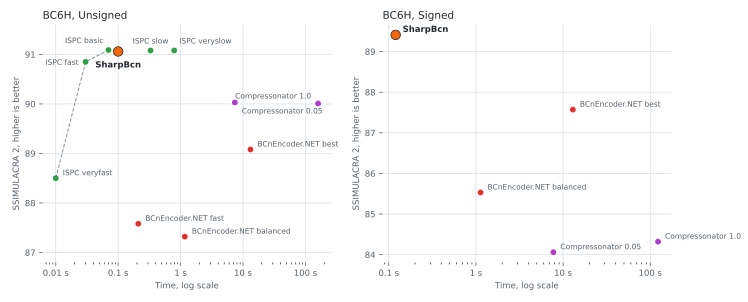

# SharpBcn

Fast, high quality BC1–BC7 texture compression for .NET, written in plain C#.

- BC1 (with optional 1-bit alpha), BC2, BC3, BC4, BC5, BC6H (unsigned and signed) and BC7
- AVX-512 and AVX2, with a fallback for other CPUs that gives the same output
- Multithreaded, no native dependencies
- Optional rate-distortion optimization (RDO) so the output compresses better with zstd, deflate or LZMA

## Usage

```csharp
using SharpBcn;

byte[] rgba = ...; // width * height * 4 bytes, RGBA order

byte[] dxt5 = BcEncoder.Encode(BcFormat.Bc3, rgba, width, height);
byte[] back = BcDecoder.Decode(BcFormat.Bc3, dxt5, width, height);

// Or write into your own buffer, e.g. one mip level of a larger file:
BcEncoder.Encode(BcFormat.Bc1, rgba, width, height, output.AsSpan(offset));

byte[] bc7 = BcEncoder.EncodeBc7(rgba, width, height);

Half[] hdr = ...; // width * height * 4 halves, RGBA order, alpha is ignored
byte[] bc6h = BcEncoder.EncodeBc6h(hdr, width, height, signed: false);
Half[] hdrBack = BcDecoder.DecodeBc6h(bc6h, width, height, signed: false);
```

`BcFormat.Bc1Alpha` makes pixels below `alphaThreshold` (default 128) transparent.

`perceptual: true` weights errors by how visible they are (luma over chroma for BC7, green over red over blue for BC1 to BC3).
It scores higher on SSIMULACRA 2 at the cost of some PSNR, so use it for color textures and leave it off for normal maps and masks.

```csharp
byte[] albedo = BcEncoder.EncodeBc7(rgba, width, height, perceptual: true);
```

## RDO

`BcRdo.Optimize` rewrites already encoded blocks so they repeat byte runs from nearby blocks, trading a little quality for a much smaller file once it's compressed with zstd, deflate or LZMA.
It's a port of the entropy reduction transform from [bc7enc_rdo](https://github.com/richgel999/bc7enc_rdo), works on every format except BC6H, and gives the same output regardless of thread count or SIMD width.

```csharp
byte[] bc7 = BcEncoder.EncodeBc7(rgba, width, height);
BcRdo.Optimize(BcFormat.Bc7, rgba, width, height, bc7, lambda: 0.5f);
```

Higher `lambda` means smaller files and lower quality, around 0.1 to 4 is useful. A 2048×2048 BC7 albedo texture with zstd level 6:

| Lambda | PSNR | Compressed size | RDO time |
|---|---|---|---|
| 0 | 59.18 dB | 1661 KiB | |
| 0.1 | 51.38 dB | 1103 KiB | 0.59 s |
| 0.5 | 47.32 dB | 811 KiB | 0.46 s |
| 1 | 45.73 dB | 740 KiB | 0.45 s |
| 4 | 43.03 dB | 588 KiB | 0.37 s |

Normal maps lose more per lambda (40.68 dB at 0.5 on the matching normal map), so use a lower value for them.

## Performance

Ryzen 7 9800X3D, 16 threads. Time includes PNG loading, quality is [SSIMULACRA 2](https://github.com/cloudinary/ssimulacra2) (higher is better).
In the charts, the dashed line connects the encoders that nothing else beats on both speed and quality.

Test images:

- Textures, 4K: [Leaf001](https://ambientcg.com/view?id=Leaf001), [MetalPlates006](https://ambientcg.com/view?id=MetalPlates006), [rusty_metal_02](https://polyhaven.com/a/rusty_metal_02). BC1 and BC7 use the color and normal maps, BC4 the grayscale ones
- [Kodak](https://r0k.us/graphics/kodak/): 24 photos, scores only since it's too small to time
- [CLIC 2020](https://www.compression.cc/) professional validation set: 41 photos

### Compared to BCnEncoder.NET

Its best quality setting, except BC7 on textures and CLIC, which use fast.



<details>
<summary>Numbers</summary>

| Format | Images | SharpBcn time | SharpBcn quality | BCnEncoder.NET time | BCnEncoder.NET quality |
|---|---|---|---|---|---|
| BC1 | Textures | 0.83 s | 83.18 | 8.39 s | 82.51 |
| BC1 | CLIC | 0.54 s | 83.33 | 9.07 s | 82.28 |
| BC1 | Kodak | | 82.78 | | 80.36 |
| BC4 | Textures | 0.34 s | 89.30 | 2.43 s | 89.18 |
| BC7 | Textures | 2.91 s | 89.92 | 112.44 s | 89.42 |
| BC7 | CLIC | 2.58 s | 91.32 | 116.57 s | 91.50 |
| BC7 | Kodak | | 92.25 | | 92.70 |
| BC6H | HDRIs | 0.10 s | 91.06 | 13.17 s | 89.08 |
| BC6H signed | HDRIs | 0.12 s | 89.41 | 12.95 s | 87.57 |

</details>

### BC1



<details>
<summary>Numbers</summary>

| Encoder | Textures time | Textures | Kodak | CLIC time | CLIC |
|---|---|---|---|---|---|
| SharpBcn | 0.83 s | 83.18 | 82.78 | 0.54 s | 83.33 |
| SharpBcn, perceptual | 0.83 s | 83.68 | 83.38 | 0.58 s | 83.99 |
| rgbcx (bc7enc_rdo), level 18 | 9.87 s | 83.70 | 83.04 | 8.63 s | 83.57 |
| rgbcx (bc7enc_rdo), level 10 | 4.02 s | 82.93 | 82.18 | 2.40 s | 82.68 |
| icbc, level 9 | 2.07 s | 82.82 | 82.62 | 2.16 s | 82.89 |
| icbc, level 8 | 0.77 s | 81.50 | 81.84 | 0.79 s | 81.95 |
| Compressonator 4.5.52, quality 1.0 | 3.15 s | 81.12 | 79.39 | 4.36 s | 80.31 |
| stb_dxt, high quality | 0.35 s | 80.70 | 79.55 | 0.26 s | 80.00 |
| ISPC Texture Compressor | 0.42 s | 77.84 | 77.55 | 0.24 s | 77.25 |
| BCnEncoder.NET 2.3.0, best quality | 8.39 s | 82.51 | 80.36 | 9.07 s | 82.28 |
| BCnEncoder.NET 2.3.0, balanced | 9.48 s | 75.40 | 80.53 | 9.48 s | 81.87 |
| BCnEncoder.NET 2.3.0, fast | 2.79 s | 69.50 | 67.89 | 2.90 s | 71.93 |

</details>

### BC4



<details>
<summary>Numbers</summary>

| Encoder | Time | Quality |
|---|---|---|
| SharpBcn | 0.34 s | 89.30 |
| Compressonator 4.5.52, quality 1.0 | 0.77 s | 89.21 |
| rgbcx (bc7enc_rdo) | 2.74 s | 88.50 |
| ISPC Texture Compressor | 0.21 s | 88.06 |
| stb_dxt, high quality | 0.18 s | 87.91 |
| BCnEncoder.NET 2.3.0, best quality | 2.43 s | 89.18 |
| BCnEncoder.NET 2.3.0, fast | 1.80 s | 89.19 |

</details>

### BC7



<details>
<summary>Numbers</summary>

| Encoder | Textures time | Textures | Kodak | CLIC time | CLIC |
|---|---|---|---|---|---|
| SharpBcn | 2.91 s | 89.92 | 92.25 | 2.58 s | 91.32 |
| SharpBcn, perceptual | 2.93 s | 90.15 | 92.79 | 2.67 s | 91.85 |
| bc7e (bc7enc_rdo), level 4 | 5.02 s | 89.93 | 92.38 | 3.38 s | 91.49 |
| bc7e (bc7enc_rdo), level 4, perceptual | 4.23 s | 90.14 | 92.80 | 2.85 s | 91.99 |
| bc7e (bc7enc_rdo), level 2 | 3.81 s | 89.60 | 92.12 | 2.07 s | 91.43 |
| bc7enc (bc7enc_rdo), level 4 | 7.55 s | 89.29 | 92.15 | 5.41 s | 91.41 |
| ISPC Texture Compressor, slow | 16.81 s | 90.00 | 92.34 | 16.61 s | 91.45 |
| ISPC Texture Compressor, basic | 5.09 s | 89.87 | 92.19 | 4.84 s | 91.36 |
| ISPC Texture Compressor, veryfast | 1.38 s | 89.60 | 92.08 | 1.21 s | 91.32 |
| Compressonator 4.5.52, quality 0.05 | 95.03 s | 89.41 | 92.16 | 193.65 s | 91.42 |
| Compressonator 4.5.52, quality 0.2 | | | 92.57 | 426.31 s | 91.66 |
| Compressonator 4.5.52, quality 0.5 | | | 92.68 | | |
| BCnEncoder.NET 2.3.0, best quality | | | 92.70 | | |
| BCnEncoder.NET 2.3.0, balanced | | | 92.45 | | |
| BCnEncoder.NET 2.3.0, fast | 112.44 s | 89.42 | 92.27 | 116.57 s | 91.50 |

</details>

On Leaf001's alpha channel SharpBcn reaches 64.9 dB PSNR, bc7e and ISPC 56 to 58 dB.

### BC6H

Three 2K HDRIs from Poly Haven: [kloppenheim_06](https://polyhaven.com/a/kloppenheim_06), [venice_sunset](https://polyhaven.com/a/venice_sunset), [studio_small_09](https://polyhaven.com/a/studio_small_09).
Signed uses the same images multiplied by a cosine wave. Time is encoding only, except for Compressonator.
SSIMULACRA 2 and mPSNR are averaged over tonemapped exposures from -4 to +4 stops, half PSNR compares the raw half floats.



<details>
<summary>Numbers</summary>

| Encoder | Time | Half PSNR | mPSNR | SSIMULACRA 2 |
|---|---|---|---|---|
| SharpBcn | 0.10 s | 61.08 dB | 50.08 dB | 91.06 |
| ISPC Texture Compressor, veryslow | 0.79 s | 61.08 dB | 50.11 dB | 91.08 |
| ISPC Texture Compressor, slow | 0.33 s | 61.07 dB | 50.10 dB | 91.08 |
| ISPC Texture Compressor, basic | 0.07 s | 60.98 dB | 50.01 dB | 91.09 |
| ISPC Texture Compressor, fast | 0.03 s | 60.71 dB | 49.74 dB | 90.85 |
| ISPC Texture Compressor, veryfast | 0.01 s | 58.71 dB | 47.96 dB | 88.50 |
| Compressonator 4.5.52, quality 1.0 | 159.78 s | 60.14 dB | 49.18 dB | 90.01 |
| Compressonator 4.5.52, quality 0.05 | 7.39 s | 60.14 dB | 49.18 dB | 90.03 |
| BCnEncoder.NET 2.3.0, best quality | 13.17 s | 58.54 dB | 48.10 dB | 89.08 |
| BCnEncoder.NET 2.3.0, balanced | 1.17 s | 57.57 dB | 47.04 dB | 87.32 |
| BCnEncoder.NET 2.3.0, fast | 0.21 s | 57.34 dB | 46.91 dB | 87.58 |
| SharpBcn, signed | 0.12 s | 53.03 dB | 46.96 dB | 89.41 |
| Compressonator 4.5.52, signed, quality 1.0 | 122.91 s | 52.52 dB | 46.58 dB | 84.32 |
| Compressonator 4.5.52, signed, quality 0.05 | 7.74 s | 52.52 dB | 46.55 dB | 84.06 |
| BCnEncoder.NET 2.3.0, signed, best quality | 12.95 s | 46.17 dB | 45.37 dB | 87.57 |
| BCnEncoder.NET 2.3.0, signed, balanced | 1.13 s | 45.64 dB | 44.39 dB | 85.53 |

</details>

ISPC has no signed BC6H, and BCnEncoder.NET's signed fast setting produced broken output.

<details>
<summary>Encoder settings</summary>

- rgbcx: `bc7enc -1 -L18`, `-1 -L10`, `-4`
- bc7e: `bc7enc -U -u4`, `-U -u2`, `-U -s -u4` for perceptual, built with ISPC 1.31
- bc7enc: `bc7enc -C -u4`
- Compressonator 4.5.52: `-fd <format> -Quality <q> -nomipmap`
- [icbc](https://github.com/castano/icbc): D3D10 decoder, equal weights, 3-color mode and 3-color black on
- [stb_dxt](https://github.com/nothings/stb/blob/master/stb_dxt.h): `STB_DXT_HIGHQUAL`
- ISPC Texture Compressor: default BC1 and BC4, `slow`, `basic` and `veryfast` BC7 profiles, all BC6H profiles
- [BCnEncoder.NET](https://github.com/Nominom/BCnEncoder.NET) 2.3.0: `BestQuality`, `Balanced` or `Fast`, no mipmaps, 16 tasks
- icbc, stb_dxt and ISPC were built with AVX-512 and run on 16 threads

</details>

## License

MIT, see [LICENSE](LICENSE). Includes tables from rgbcx, bc7decomp and DirectXTex; see [THIRD-PARTY-NOTICES.md](THIRD-PARTY-NOTICES.md).
